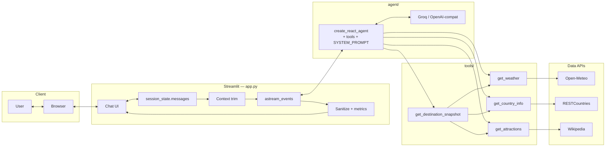

# Modern Travel Assistant

A conversation-first travel assistant built with Streamlit, LangGraph, and free LLM providers.

## Documentation map

| Document | Purpose |
|----------|---------|
| **README.md** (this file) | Setup, run, features, architecture overview, and ideas for next steps. |
| **[spec.md](spec.md)** | Detailed implementation spec for builders and coding agents (architecture, env vars, module contracts, verification). |

Optional environment variables are listed in **`.env.example`**.

## Course rubric alignment

This maps typical travel-assistant coursework criteria to **where they are implemented** so reviewers can trace **prompt engineering**, **context**, **errors**, and **evaluation** quickly.

| Criterion | How this project addresses it |
|-----------|-------------------------------|
| **Chain-of-thought prompt (multi-step reasoning)** | **`agent/prompts.py`** — section *Planning & itinerary — explicit silent chain of thought (CoT)*: five internal steps (**Goal → Who/constraints → Data → Synthesis → Shape the reply**) before answering planning-style questions; explicitly **hidden** from the user (no “Step 1…” in the UI). Simple factual questions **skip** the full CoT so answers stay fast. |
| **Concise, relevant responses** | Same file — *Length — concise answers*: **~150 words** default, direct answer first, one add-on max, tight bullets; plus **`MAX_OUTPUT_TOKENS`** in **`.env`** (see **`agent/agent.py`**) to cap generation length. |
| **Blend external data with LLM knowledge** | **Prompt:** *Data (silent)* and *User-facing rules*: use tools when live/structured data is needed; **summarize in prose** after tools (no raw dumps); combine **city + country** into one snapshot when useful. **Runtime:** ReAct agent injects tool results into the same conversation before the final reply. |
| **Decision method: external data vs. LLM knowledge** | **LLM + tools (no fixed router):** LangGraph **`create_react_agent`** lets the model **choose** tools and arguments. **Prompt** spells out when to look up (weather, country facts, attractions, trip overview) vs. answer from knowledge (packing tips, opinions) — see *Data (silent)* and the CoT **Data** step. |
| **Error handling; confused / empty / hallucination-related recovery** | **Tools** (`tools/*.py`): failures return **clear error strings** for the model to acknowledge. **Prompt** (*Honesty*): do not invent live weather, visas, or prices; point to official sources when unsure. **UI** (`app.py`): strips **leaked tool JSON** from streamed text; **empty-reply fallback** if the model returns nothing usable; **primary → fallback model** on **connection errors** or **429 / rate limits**. **Metrics** flag sanitization and empty fallback (see *Input and output evaluation*). |
| **Context management (history)** | **`st.session_state.messages`** holds the full transcript as **`HumanMessage` / `AIMessage`**. Only the last **`MAX_LLM_CONTEXT_MESSAGES`** turns are sent to the model (sliding window); full thread remains visible in the UI. **Prompt** (*Voice*): tie-ins to prior turns (“For London with kids…”). Details in **`spec.md`** (Streamlit application, session state). |
| **Evaluation focus — coherent, helpful chat** | ReAct + CoT + concision rules + follow-up tie-ins; try the **Example prompts** and multi-turn follow-ups. |
| **Evaluation focus — prompt engineering quality** | Single structured **`SYSTEM_PROMPT`** with distinct blocks (voice, length, CoT, rules, data, honesty); documented here and in **`spec.md`** section on system prompt. |
| **Evaluation focus — edge cases / LLM limits** | Long input capped (**`MAX_USER_INPUT_CHARS`**); long history windowed; tool errors as strings; Wikipedia disambiguation in **`tools/attractions.py`**; telemetry for stripped JSON and empty fallback. |
| **Evaluation focus — blending data + model** | Composite **`get_destination_snapshot`** (parallel weather + country + attractions) plus instructions to **synthesize** tool output into natural markdown for the user. |

The table is an **intentional mapping** of those criteria to this repository.

## Features

- Destination recommendations
- Packing suggestions
- Local attractions lookup
- Country facts
- Current weather lookup
- Context-aware follow-up questions
- Tool-based decision making with external APIs (including an optional **destination snapshot** tool that loads weather, country facts, and Wikipedia context **in parallel** when city and country are known)

## Tech Stack

- Python 3.12
- `uv`
- Streamlit
- LangGraph
- LangChain
- Open-Meteo API
- RESTCountries API
- Wikipedia

## Architecture

At runtime the app is a **single Streamlit process**. The browser talks only to Streamlit; Streamlit loads **`app.py`**, which builds or reuses a **cached LangGraph agent** and passes a **trimmed slice** of chat history into it each turn. The agent is a **ReAct** loop: the model may call tools zero or more times, then produce the final natural-language reply. Optional **primary → fallback** model switching runs when the primary call fails with **connection errors** or **rate limits (HTTP 429 / token caps)**.

### Agentic design and reasoning (where it lives in docs)

- **Agentic app:** The LLM **autonomously** decides whether to answer from knowledge or **call tools**, and **which** tools and arguments—there is no hard-coded “if user said weather, call `get_weather`” router. That matches the usual meaning of a **tool-using agent** (not a multi-agent swarm or long-running planner). Implementation: LangGraph **`create_react_agent`** (`agent/agent.py`); full contract in **`spec.md`** (Agent module, System prompt, and subsection **Agentic behavior and reasoning loops**).
- **Reasoning loop (runtime):** The graph repeats **model → optional tool calls → tool results → model** until the turn completes. That **ReAct** cycle is the main **reasoning/action loop** in code.
- **Reasoning (prompt):** For planning-style questions, **`agent/prompts.py`** instructs **silent chain-of-thought** (goal → constraints → data → synthesis) **inside** the model’s reasoning, without printing steps to the user. That is **not** a second loop in Python—it shapes each model step.

Together, these are what people mean by an **agentic** chat app with a **reasoning loop**; **`spec.md`** is the authoritative breakdown for implementers.



**Flow (one turn):** The UI appends the user message to **`session_state`**, rerenders history, then sends only the **last N messages** (see **`MAX_LLM_CONTEXT_MESSAGES`**) into **`astream_events`**. The **ReAct** agent loops: **LLM → optional tool calls → LLM** until a final answer streams out. **`app.py`** strips any tool-call JSON leaked into text, applies an empty-reply fallback if needed, stores **`AIMessage` + metrics**, and updates the UI.

**Model resilience:** `get_agent(use_fallback=False)` runs first; on **connection-style** failures or **429 / rate-limit** responses, the app recreates the agent with **`use_fallback=True`** and retries the same context (see **`spec.md`**).

**Composite tool:** **`get_destination_snapshot`** calls weather, country, and attractions **in parallel** (`asyncio.gather`) when the model has both a city and a country.

## Setup

### 1. Create the environment

```bash
uv python install 3.12
uv init --python 3.12
uv venv --python 3.12
source .venv/bin/activate
uv sync
# or add explicitly: uv add streamlit langchain langchain-openai langchain-community langchain-groq langgraph httpx python-dotenv wikipedia
```

### 2. Configure the model

Copy `.env.example` to `.env`.

#### Recommended: two free hosted models

Use a stronger primary model for conversation quality and a smaller fallback model for resilience.

```env
PRIMARY_API_BASE=https://api.groq.com/openai/v1
PRIMARY_API_KEY=your_primary_free_api_key_here
PRIMARY_MODEL=llama-3.3-70b-versatile

FALLBACK_API_BASE=https://api.groq.com/openai/v1
FALLBACK_API_KEY=your_fallback_free_api_key_here
FALLBACK_MODEL=llama-3.1-8b-instant
```

- `llama-3.3-70b-versatile` is the recommended **smart conversation model**
- `llama-3.1-8b-instant` is the recommended **fallback model**

#### Optional: free local Ollama model

Make sure Ollama is running, then pull a model such as:

```bash
ollama pull llama3.1:8b
```

Use this in `.env`:

```env
OLLAMA_BASE_URL=http://localhost:11434/v1
OPENAI_MODEL_NAME=llama3.1:8b
```

## Run

```bash
uv run streamlit run app.py
```

In WSL, open the shown localhost URL manually in your browser.

Optional headless smoke check (prints streamed replies and tool starts; requires a configured `.env`):

```bash
uv run python test_eval.py
```

## Example prompts

- `What should I pack for Rome in April?`
- `What are the top attractions in Paris?`
- `What is the weather in Tokyo right now?`
- `I like beaches and food. Where should I go in Spain?`

## Input and output evaluation (what the app checks)

This is **lightweight guardrails + telemetry**, not a full ML “eval harness” (no human labels, no separate judge model).

| | Input | Output |
|--|-------|--------|
| **Validation** | Messages are **trimmed**; **empty** submits are ignored; length capped at **`MAX_USER_INPUT_CHARS`** (default **4000**) so huge prompts never reach the LLM. | N/A |
| **Sanitization** | N/A | **Tool-call JSON** sometimes appears in streamed `content` from the provider; the app **strips** `{"type": "function", ...}` blobs before display and before saving to history. **Structured stream chunks** that are tool-only are dropped when possible. |
| **Fallback text** | N/A | If, after sanitization, the reply would be **empty**, a **short fallback message** is shown instead of a blank bubble. |
| **Metrics** | Rough **input token estimate** (word count of the messages **sent to the model** this turn, i.e. after **`MAX_LLM_CONTEXT_MESSAGES`** windowing). | **Latency**, rough **output** count, and flags when **tool JSON was stripped**, **empty-output fallback**, or **context trimmed** ran (caption under assistant messages). |

For coursework **evaluation**, reviewers still rely on **sample conversations**, behavior on edge cases, and your **prompt notes**—the table above is what the **code** enforces automatically.

## Notes

- **Chat memory:** The full conversation stays in the browser session (`st.session_state.messages`). Only the **last `MAX_LLM_CONTEXT_MESSAGES`** messages (default **40**) are sent to the model so long threads stay within context and cost bounds; set **`MAX_LLM_CONTEXT_MESSAGES=0`** in `.env` to send the entire history. This is **sliding-window** context, not rolling summarization (no extra LLM call).
- **Prompting:** The system prompt includes an explicit **silent chain-of-thought** block for planning-style questions (itinerary, budget, family/kids, multi-day trips): the model reasons through goal → constraints → data → synthesis **without** showing numbered steps to the user.
- **Concise answers:** Replies are guided to ~**150 words** by default, with **short paragraphs or small bullet lists**; the LLM also uses **`max_tokens`** (default **768**, set `MAX_OUTPUT_TOKENS` in `.env` to change).
- **Natural tone:** Instructions favor a warm, direct voice, brief follow-up tie-ins, and **one** clarifying question when something is vague.
- External tools supply current weather and country facts; attractions use Wikipedia-backed search (often slower).
- If the primary model is unavailable or **rate-limited (429 / daily token cap)**, the app retries once with the **fallback** model when `FALLBACK_*` is set.

## Future work and improvements

These are **not** implemented today; they are sensible next steps if you extend the project.

- **Broader model fallback:** **429 / rate limits** are covered; optional extension: **timeouts** and other HTTP errors (see `spec.md`, section 7.7).
- **Rolling memory summary:** When the context window drops old turns, optionally call the LLM once to **summarize** the removed prefix and inject a short memory line—better continuity than a plain sliding window (extra cost and latency).
- **Persistence:** Save threads to a database or file so conversations survive refresh and can be shared across devices.
- **Auth and quotas:** Simple login or API keys for a shared deployment; per-user rate limits to protect provider spend.
- **Stronger evaluation:** Scripted **golden prompts**, optional **judge model** or human rubric scoring, regression tests for tool routing.
- **Security hardening:** Light **prompt-injection** mitigations (e.g. structured tool args, output policies), optional **PII / toxicity** filters for public demos.
- **More tools:** Flights or hotels APIs (usually paid), **timezone / holidays**, **exchange rates**, **maps / POI** APIs—each with clear docstrings and error strings for the model.
- **UX:** Export chat as Markdown/PDF, dark theme, cancel in-flight generation, clearer tool progress when multiple tools run.
- **Ollama path:** Document or script **model pull** (`ollama pull …`) for new machines; optional health check before first chat.

For a concise list of **intentional non-goals** as implemented, see **spec.md** (section 11).
